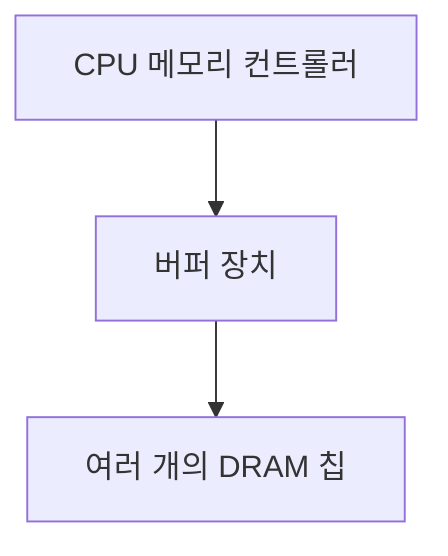
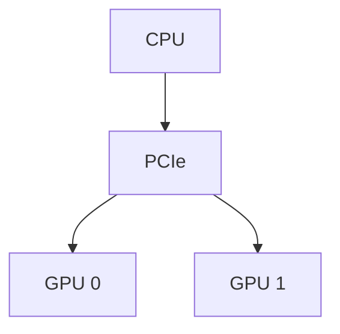
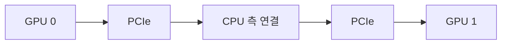
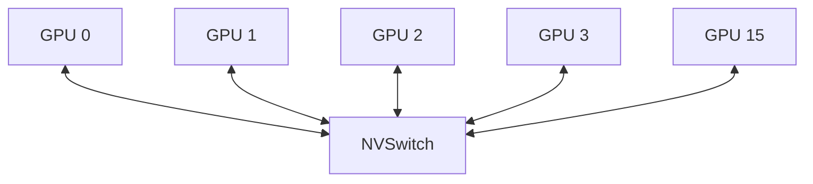
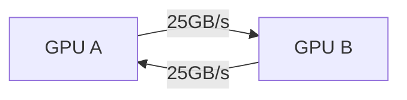

# ◼︎ Abstract

Tensor 연산의 memory 용량과 bandwidth 문제를 해결 하기 위해 Near Memory Processing(NMP)코어를 가진 DIMM모듈을 이용함.

# ◼︎ Introduction

CNN과 달리 DNN에서는 GPU나 NPU로 가속을 해결하는 부분 보다 memory wall문제가 매우 큼. Convolution 연산보다 embedding layer의 높은 memory capacity와 bandwidth를 GPU의 memory가 커버를 하지 못하고 이 부분의 workload가 매우 높음. 그래서 DNN inference에 CPU만 사용하거나 embedding만 CPU에서 하고 나머지는 GPU에서 하는 hybrid CPU-GPU를 사용함. 근데 이는 모든 embedding이 GPU memory에 저장될 수 있다고 가정하면 엄청 속도차이가 남. CPU만 사용하면 data 가져오면서 overhead가 있고 CPU-GPU를 해도 PCle channel을 통해 embedding을 복사하는 과정 때문에 latency가 생김. 

그래서 DIMM에 기반하되 Near Memory Processing(NMP) unit을 추가하여 개선한 TensorDIMM을 제시함. 상용 DRAM 장치를 그대로 활용하면서 GPU와 호환되게하는 TensorDIMM이 embedding을 훨씬 빠르게 하여 속도 향상을 시킴.

# ◼︎ Background

## Buffered DRAM Modules

<center><br></center>

우선 흔히 우리가 DRAM이라고 하는 이것은 정확히는 틀림. DRAM은 저기 검은색 칩 부분임. 이것들을 모은 것을 rank라 하고 가장 널리 사용되는 형태가 DIMM(Dual-Inline Memory Module)임. 

이제는 이런 수백개의 DRAM을 동시에 구동하기 위해 signal integrity 문제가 발생함. 이를 위해 buffer를 사용하고 대표적으로 Registerd DIMM과 Load-Reduced DIMM이 있음.



 이 buffer 장치의 공간에 custom logic을 추가하는 방안을 연구해 옴.


## System Architectures for DL

DL이 복잡해지면서 PCle 연결 보조 프로세서 장치가 필요. 여러 가속기를 병렬적으로 처리하고 서로 간의 통신함. 예를 들어 NVDIA의 DGX-2에는 16개의 GPU가 있으며 NVSwitch라고 불리는 NVLINK로 서로 연결됨. 


원래는 이렇게 연결됨.


그래서 항상 PCle를 거쳐 CPU가 제어를 하고 다음 GPU로 데이터가 이동하여 PCle의 대역폭의 영향을 받게 됨(16GB/s). 하지만 NVLINK의 경우 GPU끼리 직접 연결이 돼 있음.



이렇게 대역폭이 더 넓게 직접 연결돼기 때문에 더 빠른 속도로 데이터를 주고받을수 있음.


## DL Application with Embeddings

### 1. DNN-based recommender systems

인터넷의 추천 시스템은 embedding을 사용하는 대표적인 DL application임. 그래서 메모리 상용량이 매우 높음.

### 2. Embedding lookups and tensor manipulation

<center><br></center>

Embedding이란 이렇게 table에 특징을 추출할 수 있도혹 학습된 내요임. 이것들을 embedding vector라고 하고 여기서 dense feature와 sparse feature로 나눠지게 됨.

``` text
나이: 27
이용 시간: 3.5시간
평균 구매 금액: 45,000원
```

라고 했을때, dense feature vector는 [27, 3.5, 45000]이렇게 나타낼 수 있을 것이고 sparse feature vector의 경우 one-hot vector 형태로 [0, 0, 0, 1, 0] 인덱스 3만 사용하여 임베딩 테이블을 조회하는 방식임. 이 vector들을 서로 여러 연산을 시켜서 상호작용돼 최종 확률을 계산함.

### 3. Memory capacity limits of embedding layers

결국 전체 embedding 개수는 사용자의 수나 feature의 수에 비례해 늘어나기 때문에 차원이 기하급수적으로 늘어나며 필요한 메모리 용량도 증가함. 

# ◼︎ Motivation

## Memory(Capacity) Scaling Challenges

고성능 GPU나 NPU는 높은 메모리 bandwidth가 높은 HBM이나 HMC같은 3차원 적층 메모리를 사용함. 하지만 무한정으로 위로 쌓을수 없음. 일단 입출력 핀이 더 많이 필요해지고 발열문제도 생김. 그리고 이미 다이 크기가 거의 한계에 부딫힘.

## Memory Limits in Recommender System

위에서 말했듯 점점 embedding table의 크기가 커지게 된다. 

<center><br></center>

그래프에서 볼 수 있듯이, MLP 차원을 증가시키는 것보다 임베딩 차원을 증가시키는 것이 모델 크기를 훨씬 더 급격하게 증가시킴. 이로 인해 기존 방식의 성능을 제한하는 핵심 원인 3가지가 있음.

1. CPU memory는 대역폭이 낮아 embedding을 가져올때 지연이 발생.
2. CPU-only 방식을 하면 CPU-GPU 방식에서 embedding을 PCle로 전송할때 생기는 지연을 피할수 있음. 하지만 계산 처리 속도가 낮음.
3. CPU-GPU 방식을 하면 PCle를 사용하기 때문에 통신 지연이 생김. 

<center><br></center>

## Our Goal: A Scalable Memory System

CPU-only 방식은 MLP와 같은 DNN 계산에서 느리고, CPU-GPU 방식은 임베딩을 PCIe로 전송하는 과정에서 느려짐. 임베딩 계층의 현재와 미래의 메모리 요구사항은 메모리 용량과 대역폭을 확장 가능한 방식으로 제공하는 시스템 수준의 해결책이 시급하게 필요함.

# ◼︎ TENSORDIMM:AN NMP DIMM DESIGN FOR EMBEDDINGS & TENSOR OPS

## Proposed Approach

기존은 

```text
Embedding 0 ┐
Embedding 1 ├─ PCIe로 모두 전송 → GPU에서 reduction 연산
Embedding 2 ┘
```

이런 식으로 연산을 했다면 

```text
Embedding 0 ┐
Embedding 1 ├─ TensorDIMM에서 reduction 연산
Embedding 2 ┘
             ↓
     결과 임베딩 하나만 전송
```

TensorDIMM 방식에서는 임베딩들을 메모리 근처에서 먼저 결합한 후 결과 하나만 GPU로 보냄. 이 방식은 PCle보다 9배 높은 대역폭을 가져 gather 연산(Indexing)을 효율적으로 하고 그렇게 가져온 벡터들을 reduction 연산(덧셈, 뺄셈, 평균 등의 연산)을 하여 지연을 줄이며 계산 병목을 극복함.

## TensorDIMM for Near-Memory Tensor Ops

TensorDIMM은 3가지 설계 목표를 바탕으로 구성

1. 범용 DRAM 칩을 그대로 사용하여 DL accelerate 되지 않는 상황에도 일반적인 buffered DIMM으로 사용
2. NMP core를 사용하여 near memory에서 reduction 연산함
3. NMP core가 사용할 수 있는 memory bandwidth는 TensorDIMM 모듈 수에 비례해 증가함.

<center><br></center>

### Architecture

NMP 코어는 DDR 인터페이스, 벡터 ALU, 그리고 NMP 로컬 메모리 컨트롤러로 구성됨. NMP 로컬 메모리 컨트롤러에는 텐서 연산의 입력 피연산자와 출력 결과를 임시로 받아들이고 내보내기 위한 입출력 SRAM 큐가 포함됨. 

### TensorDIMM usages

DL이 아닐때는 memory controller가 C/A(DRAM의 명령 주소 신호)와 DQ(데이터 신호)를 송수신하며 DDR interface는 DRAM칩과 직접 상호작용.

하지만 TensorISA(gather이나 reduction)명령어를 수신하면 NMP의 memory controller로 전달됨. 그래서 ALU가 tensor 연산을 하기 전까지 SRAM 큐 A와 B에 임시로 저장됨. 이렇게 쌓인 큐에서 데이터를 꺼내 tensor 연산을 수행하고 SRAM 큐 C에 저장함. 이를 NMP controller가 확인하고 DRAM에 기록하여 tensor 연산을 완료함. 

### Implementation and overhead

TensorDIMM은 기존 DRAM칩과 관련 DDR PHY 인터페이스를 그대로 사용함. 그래서 새롭게 추가되는 요소는 NMP memory controller와 16wide vector ALU이다. Memory controller에서는 TensorISA 명령어를 FSM 로직으로 구현하기 때문에 SRAM 큐에서 면적 및 전력 오버헤드가 발생함. 이 버퍼들은 데이터를 공급하는 메모리의 대역폭-지연 곱에 해당하는 데이터를 저장할 수 있을 만큼 커야 하므로 지연 시간을 보수적으로 20ns라고 가정하여 SRAM 큐의 용량을 결정하면 $$25.6GB/s×20 ns=0.5 KB$$에 입력 큐 2개 출력 큐 1개로 총 $$1.5KB$$임.

### Memory bandwidth scaling

TensorDIMM의 중요한 설계 목표 중 하나는 NMP 텐서 연산을 위한 메모리 대역폭을 확장 가능한 방식으로 증가시키는 것임. 기존 메모리 시스템의 핵심적인 문제는 하나의 메모리 채널에 연결된 DIMM 또는 랭크의 수와 관계없이, 각 메모리 채널의 최대 대역폭이 고정되어 있음. ensorDIMM은 TensorNode라고 부르는 분리형 메모리 시스템을 구성하는 기본 단위로 사용함. 이는 각 DIMM 자체에 NMP 코어가 있고 그 코어가 자신의 DRAM에 독립적으로 연결돼있끼 때문에 대역폭도 증가함.

## System Architecture

메모리 용량 확장 가능, 대역폭 확장 가능

## Software Architecture

<center><br></center>

<center><br></center>


figure 7과 8은 주소가 어떻게 구성됐는지와 Instruction 구성을 알려줌.

# ◼︎ EVALUATION METHODOLOGY

TensorDIMM은 단순한 메모리 구조만 바꾸는 것이 아니라서 하드웨어만 사이클 단위로 시뮬레이션하면 전체 시스템의 실제 동작을 제대로 반영하기 어렵고, 딥러닝 추론 자체가 길어서 시뮬레이션 시간도 너무 오래 걸리기 때뭄에 Ramulator simulation을 통해 DRAM 대역폭을 잘 사용하는지 평가하고 V100 GPU 기반 emulation을 통해 재현함.

# ◼︎ EVALUATION

TensorDIMM은 메모리 대역폭이 증가, 추천 시스템 추론이 속도 증가, 임베딩이 커질수록 이점이 증가, 느린 인터커넥트에서도 비교적 안정적이라는 평가를 가짐.

