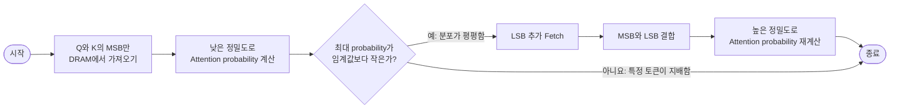
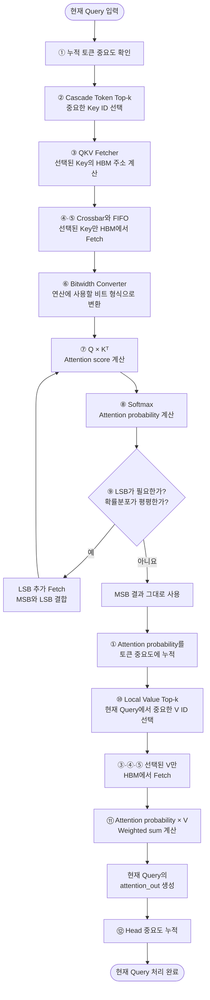
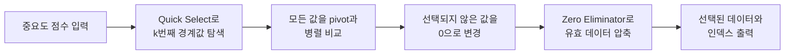

# ◼︎ Abstract

Attention 모델이 우세한데 기존의 신경망 가속기는 주로 합성곱 모델이나 순환 모델의 최적화에만 초점을 맞추고 있기에 효율적이지가 않음. Attention의 연산량과 memory access를 줄이기 위해 token sparsity,
head sparsity, 그리고 quantization opportunity를 활용하는 SpAtten을 제안함. 

이는 인간 언어에 높은 중복성으로 인해 문장에서 중요하지 않은 token을 제거하는 새로운 **cascade token pruning**방식과 불필요한 head를 제거하는 **cascade head pruning**을 제안함. 이는 기존의 weight pruning과 다르며 실시간으로 선택하는 방식으로 중요도 점수에 따라 높은 처리량으로 처리하는 top-k engine을 설계함. 그리고 최상위 비트인 MSB를 가져와 연산을 수행하고 신뢰도가 낮은 경우 최하위 비트인 LSB를 추가로 가져와 연산하는 **progressive quantization**을 제안함. 

# ◼︎ Introduction

NLP가 빠르게 발전했지만 여기에 들어가는 attention은 복잡한 data movement와 매우 낮은 general-purpose platforms으로 인해 GPU나 CPU에서 느림. 특히 모바일 장치에서는 사용할수가 없고 많은 CNN와 RNN 가속기가 제안됐지만 attention은 다른 연산 특성을 가지기 때문에 적용이 힘듬.

그래서 SpAtten을 제안하는데 이는 세가지 알고리즘 최적화 기법을 사용함.

1. Cascade token pruning
2. Cascade head pruning
3. Progressive quantization

<center><br></center>
Figure 1은 Cascade token&head pruning에 대한 설명임. 결국 이렇게 pruning이 돼서 연산량과 memory access가 감소한다는 뜻임.

## BERT-Base

Token: 기본 분해 단위, 각 토큰은 768차원 vector
```text
film
  ↓
[0.12, -0.38, 0.57, ..., 0.21]
          768개 숫자
```
이 숫자들은 단어의 feature와 관련있음.

Head: 이 feature들을 그룹화 한것임. 12개인 이유는 $$768÷12=64$$로 한개의 head는 token의 64차원부분을 처리함.

<center><br></center>


| 모델 | 구조 및 처리 방식 | 규모 | 핵심 변화 |
|---|---|---|---|
| **GPT-1** | 2018<br>Decoder-only<br>왼쪽 → 오른쪽 | 117M<br>FP32 약 468MB | 사전학습 후 작업별 미세조정 |
| **BERT-Base** | 2018<br>Encoder-only<br>양방향 문맥 | 110M<br>FP32 약 440MB | 양방향 문맥 처리로 언어 이해 강화 |
| **GPT-2 XL** | 2019<br>Decoder-only<br>왼쪽 → 오른쪽 | 1.5B<br>FP32 약 6.2GB | 모델·데이터·문맥 길이 확장 |

그래서 GPT-2가 32개 토큰을 생성할 때 생성 단계가 전체 지연 시간의 97%를 차지하며 memory-bound이고, BERT는 computation-bound임. GPT-2 이후로 부터는 parameter 크기가 매우 커지기 때문에 computation 시간보다 data movement에서 사용하는 시간을 줄여야함. 그래서 DRAM 접근량과 연산량을 모두 줄이기 위해 cascade token pruning을 제안함. 

인간의 언어에는 전치사, 관사, 부사와 같은 구조적인 토큰이나 의미가 적은 토큰이 많아 중복성이 높다는 점에서 착안하여, 결과에 거의 영향을 주지 않는 중요하지 않은 토큰을 안전하게 제거할 수 있음. 어텐션은 다양한 의존 관계를 포착하기 위해 여러 개의 헤드를 사용하지만, 이 가운데 일부 헤드 역시 중복적임. 따라서 각 헤드가 출력에 미치는 영향을 기반으로 헤드의 중요도를 판단하고, 중요하지 않은 헤드를 제거하는 cascade head pruning도 제안함. 

이는 기존의 weight pruning와 activation pruning과 다른 방식이고 제거되는 token과 head가 실행 중에 선택 되어 cumulative 점수에 따라 제거하는 평균 $$O(n)$$시간 복잡도의 고병렬 전용 top-k 엔진을 설계함. 이로 인해 8개의 GPT-2 모델을 기준으로 토큰 프루닝과 헤드 프루닝은 DRAM 접근량과 연산량을 각각 평균 3.8배와 추가 1.1배 줄일 수 있음.

DRAM 접근량을 더욱 줄이기 위해 저자들은 어텐션 입력에 대한 progressive quantization도 제안함. 양자화 오차가 어텐션 확률분포와 관련되기 때문에 소수의 토큰이 어텐션 확률분포를 지배하는 경우에는 양자화 오차가 작으므로 MSB만 필요하지만 어텐션 확률이 평평하게 분포하는 경우에는 양자화 오차가 크므로 LSB와 MSB가 모두 필요하다는 성질을 이용함. 먼저 어텐션 입력의 MSB만 가져와 어텐션 확률을 계산 하고 계산된 최대 확률이 기준값보다 작다면, 확률분포가 평평하다는 의미이므로 LSB를 칩 내부로 추가로 가져와 어텐션 확률을 다시 계산하는 방식을 사용해 memory access를 추가로 5.1배 줄임.

## Attention accelerators $$A^3$$ and MNNFast 

이 두 가속기 또한 sparsity를 이용하지만 3가지 한계를 가지고 있음.

1. 모든 data를 DRAM에서 가져와야하기 때문에 이미 data access cost가 높음. Computation-bound만 해결 가능하기 때문에 memory-bound는 해결 안됨.
2. Head pruning이 없어서 head sparsity를 전혀 사용하지 못함.
3. $$A^3$$는 하나의 헤드 내부에서만 특정 토큰의 QKV 벡터를 지역적으로 제거하고, MNNFast는 V 벡터만 지역적으로 제거하기 때문에  이들은 어텐션 계층의 연산량만 줄일 뿐, FFN 계층의 연산량은 줄이지 못함.


# ◼︎ Background and Motivation

## A. Background

### Attention-Based NLP Models

MLP의 task는 크게 discriminative task와 generative task로 나눠짐. Discriminative task에서는 모델이 input information을 summarize 한 후 prediction을 수행하고 generative task는 input information을 summarize한 후 new token을 생성함. BERT는 discriminative model이고 GPT-2는 generative 모델임.

<center><br></center>

BERT-base의 경우 summarization만 하게 되는데 token embedding이 되고 block 한개가 layer 1개에 대응됨. 그래서 마지막 block에서 classification을 통해 최종 결과를 얻음. 하지만 GPT-2의 경우 LM head를 적용해 새로운 token 하나를 생성하여 generation stage로 진입하여 계속 new token 생성하다가 EOS(End Of Sentence) token이 생성되거나 미리 정한 제한에 도닥하여 종료됨. 

Generative stage와 summarize stage의 차이는 문장 전체가 아닌 하나의 token만 처리한다는 것이고 K와 V가 현재의 token의 KV가 이어붙여져 점점 늘어나고 이게 KV cache인 것임. 

### Attention Mechanism

$$
\mathtt{Attention \; score}= \frac{Q_iK_i^{T}}{\sqrt{D}}
$$

$$
\operatorname{Attention}(Q,K,V)
=
\operatorname{Softmax}
\left(
\mathtt{Attention \; score}
\right)V
=
\operatorname{Softmax}
\left(
\frac{QK^T}{\sqrt{D}}
\right)V
$$

> $$Q$$: Query, 현재 토큰이 찾고 싶은 정보, 다른 토큰 중 무엇을 참고할지 질문(나는 어떤 정보를 찾는가)
>
> $$K$$: Key, 각 토큰이 가진 특징표, Query와 비교되어 관련도를 계산(나느 어떤 정보와 관련 있는가)
>
> $$V$$: Value, 각 토큰이 실제로 전달할 정보, 관련도에 따라 가중합(내가 실제로 제공할 정보는 무엇인가)

## B. Motivation

결국 GPT-2 모델의 경우 end-to-end latency를 보면 데이터 이동 작업에 시간이 제일 많이 쓰임. 그래서 NLP 모델의 FC 계층은 FC 연산에 최적화된 GPU, CPU, 가속기 등을 사용하고 SpAtten은 attention 계층을 처리함.

# ◼︎ Algorithm Optimization

<center><br></center>
<center><br></center>


```text
As a visual treat, the film is almost perfect.
```
이 문장의 토큰이 11개라고 하고 attention head가 12로 생각해보면,

```text
             Head 1  Head 2  Head 3  ...  Head 12
As              ●       ●       ●            ●
a               ●       ●       ●            ●
visual          ●       ●       ●            ●
treat           ●       ●       ●            ●
,               ●       ●       ●            ●
the             ●       ●       ●            ●
film            ●       ●       ●            ●
is              ●       ●       ●            ●
almost          ●       ●       ●            ●
perfect         ●       ●       ●            ●
.               ●       ●       ●            ●
```

## A. Cascade Token Pruning

the의 중요도가 낮다고 했을 때,

```text
             Head 1  Head 2  Head 3  ...  Head 12
As              ●       ●       ●            ●
a               ●       ●       ●            ●
visual          ●       ●       ●            ●
treat           ●       ●       ●            ●
,               ●       ●       ●            ●
the             ×       ×       ×            ×   ← 제거
film            ●       ●       ●            ●
is              ●       ●       ●            ●
almost          ●       ●       ●            ●
perfect         ●       ●       ●            ●
.               ●       ●       ●            ●
```

언어에서 중요하지 않은 토큰을 제거하는 방법을 attention probability 기반으로 cascade token pruning을 제안함. Cumulative token importance scores이 담긴 array를 사용하여 제거할 토큰을 결정함. 

## B. Cascade Head Pruning

```text
             Head 1  Head 2  Head 3  Head 4  ...  Head 12
As              ●       ●       ×       ●            ●
a               ●       ●       ×       ●            ●
visual          ●       ●       ×       ●            ●
treat           ●       ●       ×       ●            ●
,               ●       ●       ×       ●            ●
the             ●       ●       ×       ●            ●
film            ●       ●       ×       ●            ●
is              ●       ●       ×       ●            ●
almost          ●       ●       ×       ●            ●
perfect         ●       ●       ×       ●            ●
.               ●       ●       ×       ●            ●
```

일부 head는 중복되어 있으며 최종 출력에 거의 영향을 미치지 않기 때문에 제거해도 됨. Attention_out 원소의 절댓값을 누적하여 계산함.

### Algorithm

$$
P
=
\mathtt{attention\_prob}
\in
\mathbb{R}^{h \times L_0 \times L_1}
$$

$$
E
=
\operatorname{Reshape}(\mathtt{attention\_out})
\in
\mathbb{R}^{h \times L_0 \times D}
$$

$$
s_t^{\mathrm{prev}}
\in
\mathbb{R}^{L_1},
\qquad
s_h^{\mathrm{prev}}
\in
\mathbb{R}^{h}
$$

- $$h$$: 현재 head 수
- $$L_0$$: Query 토큰 수
- $$L_1$$: Key·Value 토큰 수
- $D$: head 하나의 feature 차원
- $$P_{m,i,j}$$: head m에서 Query i가 Key 토큰 j를 참고하는 확률
- $$E_{m,i,d}$$: head m의 attention 출력값

#### Token Cumulative

$$
s_t^{\mathrm{new}}[j]
=
s_t^{\mathrm{prev}}[j]
+
\sum_{m=1}^{h}
\sum_{i=1}^{L_0}
P_{m,i,j},
\qquad
j=1,\ldots,L_1
$$

#### Head Cumulative

$$
s_h^{\mathrm{new}}[m]
=
s_h^{\mathrm{prev}}[m]
+
\sum_{i=1}^{L_0}
\sum_{d=1}^{D}
\left|
E_{m,i,d}
\right|,
\qquad
m=1,\ldots,h
$$

#### Remain Token

$$
k_t
=
\left\lfloor
L_1(1-p_t)
\right\rfloor
$$

$$
\mathcal{T}_{\mathrm{remain}}
=
\operatorname{TopKIndex}
\left(
s_t^{\mathrm{new}},
k_t
\right)
$$

#### Remain Head

$$
k_h
=
\left\lfloor
h(1-p_h)
\right\rfloor
$$

$$
\mathcal{H}_{\mathrm{remain}}
=
\operatorname{TopKIndex}
\left(
s_h^{\mathrm{new}},
k_h
\right)
$$

## C. Local Value Pruning

제거할 V 벡터는 오직 현재 head의 attention probability를 기준으로 결정하여 attention probability가 가장 작은 V 벡터들 가운데 미리 정해진 비율만큼을 제거하며, 제거된 V 벡터는 attention_prob × V 연산을 위해 메모리에서 가져오지 않는 방식임.

## D. Progressive Quantization

Attention score:

$$
s_i
=
\frac{QK_i^T}{\sqrt{D}}
$$

Attention probability:

$$
p_i
=
\frac{\exp(s_i)}
{\displaystyle\sum_{j=0}^{L_1-1}\exp(s_j)}
$$

이 상태에서 Q와 K를 낮은 bit로 표현하면(quantization) 오차가 생김

$$
\hat{s}_i
=
s_i+\Delta s_i
$$

하지만 softmax를 하면 이를 완화시킬 수 있는데, probability $$p_i$$를 입력 $$score s_j$$에 대해 미분하면 다음과 같음.

$$
\frac{\partial p_i}{\partial s_j}
=
\begin{cases}
p_i(1-p_i), & i=j, \\[6pt]
-p_ip_j, & i\neq j.
\end{cases}
$$

하나의 attention score $$s_0$$에 양자화 오차 $$\Delta s_0>0$$가 발생했다고 가정하면, probability의 변화량은 다음과 같이 근사할 수 있음.

$$
\Delta p_i
\approx
\frac{\partial p_i}{\partial s_0}\Delta s_0
=
\begin{cases}
\Delta s_0p_0(1-p_0), & i=0, \\[6pt]
-\Delta s_0p_ip_0, & i\neq0.
\end{cases}
$$

Softmax 출력 전체에서 발생한 절대 오차의 합은 다음과 같음.
$$
\begin{aligned}
\mathrm{Error}
&=
\sum_{i=0}^{L_1-1}|\Delta p_i| \\[4pt]
&=
\left|
\Delta s_0p_0(1-p_0)
\right|
+
\sum_{i=1}^{L_1-1}
\left|
-\Delta s_0p_ip_0
\right| \\[4pt]
&=
\Delta s_0p_0(1-p_0)
+
\Delta s_0p_0
\sum_{i=1}^{L_1-1}p_i \; (\because \sum_{i=1}^{L_1-1}p_i=1-p_0)\\[4pt]
&=
\Delta s_0p_0(1-p_0)
+
\Delta s_0p_0(1-p_0) \\[4pt]
&=
2\Delta s_0p_0(1-p_0).
\end{aligned}
$$

또한 $$0\le p_0\le1$$일 때 다음 부등식이 성립함.

$$
2p_0(1-p_0)
\le
\frac{1}{2}
$$

따라서 Softmax 출력의 전체 오차는 다음과 같이 제한됨.

$$
\boxed{
\mathrm{Error}
=
2\Delta s_0p_0(1-p_0)
\le
\frac{\Delta s_0}{2}
<
\Delta s_0
}
$$

즉, attention score에 $$\Delta s_0$$만큼의 양자화 오차가 발생해도 Softmax를 통과한 probability의 전체 오차는 최대 절반보다도 작음. 그랫허 양자와를 해도 크게 문제가 되지 않음.

그럼에도 불구하고 static quantization을 사용하면 정확도가 떨어지게 됨. 그래서 이런 경우에 bit를 다시 점진적으로 증가하는 progressive quantization을 사용하려는 것이다. 

<center><br></center>

figure7은 분산이 작을 경우 error가 매우 작지만 클 경우에는 error가 커짐. 즉, 토큰들의 확률 차이가 작을 때 약간의 양자화 오차만 생겨도 순위가 바뀔 수 있기 때문에 이럴때 LSB를 가져와 정확도를 다시 복구함. 


즉, 

$$
P^{\mathrm{MSB}}
=
\operatorname{Softmax}
\left(
\frac{
Q^{\mathrm{MSB}}
\left(K^{\mathrm{MSB}}\right)^T
}{
\sqrt{D}
}
\right)
$$

$$
p_{\max}
=
\max_j P_j^{\mathrm{MSB}}
$$

$$
P_{\mathrm{final}}
=
\begin{cases}
P^{\mathrm{MSB}},
&
p_{\max}\ge\tau
\\[6pt]
P^{\mathrm{MSB+LSB}},
&
p_{\max}<\tau
\end{cases}
$$

제일 큰 확률이 $$\tau$$를 넘지 못할 때는 bit를 다시 확장해서 연산함.

이는 GPT-2에서만 사용하는데 memory-bound가 문제이기 때문에 입력을 DRAM에서 읽는 data 자체가 줄어들면 성능이 높아지기 때문에 중요하지만 BERT는 computation-bound가 문제기 때문에 오히려 느려지기 때문에 그냥 static quantization만 사용함. 평균적으로 LSB까지 추가로 가져와야 했던 입력은 5.9%정도로 대부분의 경우 quantization인 상태로 사용해도 됨. 

# ◼︎ Hardware Architecture

## Overview

<center><br></center>

SpAtten은 token&head pruning을 하기 위해 top-k engine을 사용함. 연산량이 줄어드는 대신 memory의 random access가 증가하기 때문에 crossbar를 사용하여 항상 memory channel이 busy하게 함. 그리고 progressive quantization을 지원하기 위해 on-chip bitwidth converter를 사용함.

### Why pruning occurs random access

일반적으로 모든 토큰을 읽으면 K0 → K1 → K2 → K3 → K4 이런식으로 메모리에서 순서대로 가져올 수 있음. 하지만 pruning으로 제거되면 K0 → K2 → K4 이렇게 불규칙해야하기 때문에 SpAtten은 crossbar를 사용해 여러 요청을 16개의 HBM 채널로 적절히 분산함.

### Processing one query in  SpAtten

SpAtten은 모든 K와 V를 먼저 가져오는 것이 아니라, Top-k 엔진으로 필요한 데이터부터 고른 뒤 HBM에서 가져옴. 

예를 들어 현재 Query가 문장 속 `more` 토큰이라고 하면, 이 Query가 중요한 Key를 찾고 필요한 Value 정보를 가져와 `attention_out`을 만드는 과정은 다음과 같음.

## SpAtten에서 Query 하나가 처리되는 과정

SpAtten은 Attention head 하나에 속하는 **Query 벡터 하나씩** 파이프라인에 입력하여 처리합니다.

예를 들어 현재 Query가 문장 속 `more` 토큰이라고 하면, 이 Query가 중요한 Key를 찾고 필요한 Value 정보를 가져와 `attention_out`을 만드는 과정은 다음과 같습니다.

---



---

### 1. 현재 Query를 입력

SpAtten은 한 번에 특정 head의 Query 하나를 처리함.

BERT-Base처럼 head 하나의 차원이 64라면 Query는 다음과 같은 벡터임.

$$
Q\in\mathbb{R}^{64}
$$

예를 들어 현재 Query가 `more` 토큰이라면, 이 Query는 다른 토큰 중 어떤 정보를 참고할지 계산함.

```text
현재 Query: more

more는 fun을 얼마나 참고해야 하는가?
more는 than을 얼마나 참고해야 하는가?
more는 film을 얼마나 참고해야 하는가?
```

---

### 2. 누적 중요도가 높은 Key를 선택

#### 사용 모듈

- **Token Importance Score Accumulator**
- **Top-k for Cascade Token Pruning**

SpAtten에는 앞선 Query, head, layer에서 계산한 토큰별 누적 중요도가 저장되어 있음.

```text
토큰       누적 중요도

I             0.4
bet           1.0
the           0.3
video         1.2
game          1.7
is            1.0
a             0.4
lot           1.8
more          0.6
fun           1.9
than          1.4
the           0.3
film          0.9
.             0.4
```

Top-k 엔진은 이 점수 중 큰 값을 가진 토큰만 선택함.

```text
선택된 Key ID 예시

fun
lot
game
than
video
...
```

이 단계에서는 Key 벡터 자체가 아니라, 메모리에서 가져와야 할 **Key의 인덱스**를 먼저 선택함.

---

### 3. Top-k 엔진은 중요한 항목을 찾는 방법

Top-k 엔진은 모든 값을 완전히 정렬하지 않고, **Quick Select**로 $k$번째로 큰 경계값을 찾음.

```text
입력: [0.6, 0.1, 0.5, 1.2, 0.6]
k = 3
```

Quick Select는 세 번째로 큰 값인 `0.6`을 찾음.

```text
pivot = 0.6
```

그다음 모든 값을 pivot과 병렬로 비교함.

```text
0.6 = pivot  → 선택
0.1 < pivot  → 제거
0.5 < pivot  → 제거
1.2 > pivot  → 선택
0.6 = pivot  → 선택
```

선택되지 않은 값은 0으로 바뀜.

```text
[0.6, 0, 0, 1.2, 0.6]
```

마지막으로 **Zero Eliminator**가 중간에 있는 0을 제거하고 선택된 값과 ID를 앞으로 모아줌.

```text
입력 : [0.6, 0,   0,   1.2, 0.6]
출력 : [0.6, 1.2, 0.6, 0,   0  ]
```

Top-k 엔진의 내부 흐름은 다음과 같음.



---

### 4. 선택된 Key의 HBM 주소를 계산

#### 사용 모듈

- **QKV Fetcher**

Top-k 엔진이 선택한 Key ID를 실제 HBM 메모리 주소로 변환함.

```text
Key ID: fun
→ HBM 주소 계산

Key ID: than
→ HBM 주소 계산
```

---

### 5. Crossbar가 HBM 요청을 분배

#### 사용 모듈

- **32×16 Address Crossbar**
- **16×32 Data Crossbar**
- **Address·Data FIFO**

선택된 Key는 16개의 HBM 채널에 흩어져 있을 수 있음.

```text
K_video → HBM Channel 2
K_game  → HBM Channel 11
K_fun   → HBM Channel 5
K_than  → HBM Channel 2
```

Address Crossbar는 최대 32개의 주소 요청을 16개 HBM 채널에 분배함.

```text
선택된 Key 주소
        ↓
32×16 Address Crossbar
        ↓
16개 HBM 채널
```

HBM에서 데이터가 반환되는 순서는 원래 요청 순서와 다를 수 있어서 Data Crossbar가 반환된 데이터를 원래 순서에 맞게 다시 배치함.

```text
HBM에서 반환된 데이터
        ↓
16×32 Data Crossbar
        ↓
원래 요청한 Key 순서로 복원
```

Crossbar는 프루닝으로 발생한 불규칙한 메모리 요청을 처리하고, 여러 HBM 채널이 최대한 쉬지 않고 동작하도록 함.

---

### 6. Bitwidth Converter가 데이터를 변환

#### 사용 모듈

- **Bitwidth Converter**

Progressive Quantization에서는 처음부터 Q와 K의 전체 비트를 가져오지 않고 MSB만 가져옴.

예를 들어 `4+4` 설정이라면:

```text
첫 번째 Fetch: MSB 4비트
필요한 경우: LSB 4비트 추가
```

Bitwidth Converter는 가져온 MSB 또는 `MSB+LSB` 데이터를 연산기가 사용할 형식으로 바꿈.

```text
MSB 데이터
    ↓
Bitwidth Converter
    ↓
내부 연산 형식으로 변환
```

LSB가 추가된 경우에는 다음처럼 결합함.

```text
MSB + LSB
    ↓
더 높은 정밀도의 Q와 K
```

---

### 7. Query와 Key의 내적을 계산

#### 사용 모듈

- **Matrix–Vector Multiplication Module**

현재 Query와 선택된 Key를 비교하여 Attention score를 계산함.

$$
S_j
=
\frac{QK_j^T}{\sqrt{D}}
$$

현재 Query가 64차원이고 Key를 8개씩 병렬로 처리한다면:

$$
Q\in\mathbb{R}^{64}
$$

$$
K_{\mathrm{batch}}
\in
\mathbb{R}^{8\times64}
$$

하드웨어는 다음 8개의 내적을 병렬로 계산함.

$$
QK_0^T,\;
QK_1^T,\;
\ldots,\;
QK_7^T
$$

하나의 내적 내부에서는 64개의 원소별 곱셈을 수행함. 이를 8개의 Key에 대해 병렬로 수행하므로 한 번에 8개의 score를 계산할 수 있음.

---

### 8. Softmax로 Attention probability를 계산

#### 사용 모듈

- **Softmax Module**

계산된 Attention score에 Softmax를 적용함.

예를 들어 다음과 같은 probability가 만들어질 수 있음.

```text
video   0.05
game    0.08
lot     0.10
fun     0.37
than    0.35
film    0.05
```

이 결과는 현재 Query가 각 Key 토큰을 얼마나 참고할지 나타냄.

---

### 9. Progressive Quantization이 재계산 여부를 결정

#### 사용 모듈

- **Progressive Quantization**

처음 MSB만으로 계산한 probability의 최댓값을 확인함.

$$
p_{\max}
=
\max_j P_j
$$

#### 확률이 특정 토큰에 집중된 경우

```text
[0.03, 0.02, 0.90, 0.05]
```

가장 큰 probability가 충분히 크므로 결과가 명확하다고 판단.

```text
LSB Fetch 없음
→ MSB 계산 결과 그대로 사용
```

#### 확률분포가 평평한 경우

```text
[0.27, 0.25, 0.24, 0.24]
```

가장 큰 probability가 임계값보다 작으면 양자화 오차에 민감하다고 판단.

```text
LSB 추가 Fetch
       ↓
MSB와 LSB 결합
       ↓
Q × Kᵀ 재계산
       ↓
Softmax 재계산
```

수식으로는 다음과 같이 나타낼 수 있습니다.

$$
P_{\mathrm{final}}
=
\begin{cases}
P^{\mathrm{MSB}},
&
p_{\max}\ge\tau,
\\[6pt]
P^{\mathrm{MSB+LSB}},
&
p_{\max}<\tau.
\end{cases}
$$

LSB가 필요하면 처음 계산한 probability는 버리고, 높은 정밀도로 다시 계산.

---

### 10. Probability를 토큰 중요도에 누적

#### 사용 모듈

- **Token Importance Score Accumulator**

최종적으로 확정된 Attention probability는 각 토큰의 누적 중요도에 더해짐.

$$
s_t[j]
\leftarrow
s_t[j]+P_j
$$

예를 들어 현재 Query가 `fun`에 0.37의 확률을 주었다면:

```text
기존 fun 중요도: 1.90
현재 probability: 0.37
새로운 중요도:   2.27
```

이 점수는 이미 진행 중인 현재 Key 선택이 아니라, 이후 Query·head·layer에서 수행되는 토큰 프루닝에 사용됨.

---

### 11. 현재 Query에서 중요한 Value만 선택

#### 사용 모듈

- **Local Value Pruning Top-k**

이번에는 누적 토큰 중요도가 아니라, 현재 Query에서 방금 계산한 Attention probability를 Top-k 엔진에 넣음.

```text
video   0.05
game    0.08
lot     0.10
fun     0.37
than    0.35
film    0.05
```

예를 들어 상위 3개만 남기면:

```text
V_fun
V_than
V_lot
```

만 선택됨.

```text
현재 Attention probability
        ↓
Quick Select로 경계값 탐색
        ↓
병렬 비교
        ↓
Zero Eliminator
        ↓
Remained Value IDs
```

Local Value Pruning은 현재 Query와 현재 head에서만 적용됨.

---

### 12. 선택된 Value만 HBM에서 가져옵

선택된 Value ID는 다시 QKV Fetcher로 전달. 확률이 작은 Value는 HBM에서 아예 읽지 않음.

```text
V_video → Fetch하지 않음
V_game  → Fetch하지 않음
V_fun   → Fetch
V_than  → Fetch
V_lot   → Fetch
```

따라서 Local Value Pruning도 DRAM 접근량을 줄임.

---

### 13. Probability와 Value를 곱해 Weighted Sum을 만듬

#### 사용 모듈

- **Attention Probability × V Module**

남은 probability와 Value를 곱하고 모두 더함.

$$
E_Q
=
\sum_{j\in\mathcal{V}_{\mathrm{remain}}}
P_jV_j
$$

예를 들어 현재 Query가 `more`라면:

$$
E_{\mathrm{more}}
=
0.37V_{\mathrm{fun}}
+
0.35V_{\mathrm{than}}
+
0.10V_{\mathrm{lot}}
$$

하드웨어 내부에서는 다음 연산이 병렬로 수행됨. 이 결과는 현재 head에서 현재 Query 하나에 대한 Attention 출력임.

---

### 14. Head 중요도를 누적

#### 사용 모듈

- **Head Importance Score Accumulator**

생성된 `attention_out`의 절댓값을 더하여 현재 head의 중요도에 누적.

$$
s_h[m]
\leftarrow
s_h[m]
+
\sum_d
\left|E_{m,Q,d}\right|
$$

---

### 한 layer가 끝난 뒤의 Head Pruning

#### 사용 모듈

- **Top-k for Cascade Head Pruning**

Head pruning은 Query 하나마다 수행하지 않음. 현재 layer의 모든 Query와 모든 head 계산이 끝난 뒤, 누적된 head 중요도를 이용하여 중요도가 낮은 head를 제거함.

$$
\mathcal{H}_{\mathrm{remain}}
=
\operatorname{TopKIndex}
\left(
s_h,k_h
\right)
$$

---

### 전체 과정 요약

```text
Query 하나 입력
    ↓
누적 토큰 중요도로 중요한 Key ID 선택
    ↓
선택된 Key만 HBM에서 Fetch
    ↓
Bitwidth 변환
    ↓
Q × Kᵀ로 Attention score 계산
    ↓
Softmax로 Attention probability 계산
    ↓
확률분포가 평평하면 LSB 추가 후 재계산
    ↓
Probability를 토큰 중요도에 누적
    ↓
현재 Probability로 중요한 Value ID 선택
    ↓
선택된 Value만 HBM에서 Fetch
    ↓
Attention probability × Value
    ↓
현재 Query의 attention_out 생성
    ↓
Head 중요도 누적
```

## B. Top-k Engine & C. Zero Eliminator

<center><br></center>

Pruning을 하기 위해서 배열에서 가장 큰 k개의 원소를 찾아야 함. 제일 단순하게 sorter를 사용하여 원래 배열을 전체 정렬한 뒤 앞의 k개 elements를 출력하는 방식이 있지만 이의 time complexity는 $$O(nlogn)$$이고 spaxe complexity는 $$O(nlog2n)$$에다가 fetch 순서가 ramdom이 돼 비효울적임. 그래서 Top-k engine은 quick select를 사용하기 때문에 $$O(n)$$의 time complexity도 줄고 original order를 따르게 됨.

### figure 9 설명

현재 탐색 중인 후보 집합을 $$\mathcal{C}$$, 찾으려는 순위를 $$r$$이라고 하면

- $$r=1$$: 가장 큰 값
- $$r=2$$: 두 번째로 큰 값
- $$r=k$$: $$k$$번째로 큰 값

현재 후보 집합에서 임의의 pivot $$p$$를 하나 선택함.

$$
p\in\mathcal{C}
$$

pivot을 기준으로 후보를 세 집합으로 나눔.

$$
\begin{aligned}
\mathcal{R}(p)
&=
\{x\in\mathcal{C}\mid x>p\},
\\[4pt]
\mathcal{E}(p)
&=
\{x\in\mathcal{C}\mid x=p\},
\\[4pt]
\mathcal{L}(p)
&=
\{x\in\mathcal{C}\mid x<p\}.
\end{aligned}
$$

각 집합의 원소 수를 다음과 같이 정의함.

$$
g=|\mathcal{R}(p)|,
\qquad
e=|\mathcal{E}(p)|
$$

- $$g$$: pivot보다 큰 값의 개수
- $$e$$: pivot과 같은 값의 개수

다음 탐색 범위와 목표 순위는 아래 조건에 따라 결정.

$$
(\mathcal{C}_{\mathrm{next}},r_{\mathrm{next}})
=
\begin{cases}
\left(\mathcal{R}(p),r\right),
&
r\le g,
\\[6pt]
\text{종료: }p\text{가 }r\text{번째로 큰 값},
&
g<r\le g+e,
\\[6pt]
\left(\mathcal{L}(p),r-g-e\right),
&
r>g+e.
\end{cases}
$$

각 조건의 의미는 다음과 같음.

#### 1. $$r\le g$$: pivot이 너무 작음

pivot보다 큰 값만으로도 찾으려는 순위 $$r$$에 도달.

따라서 $$r$$번째로 큰 값은 pivot보다 큰 집합 안에 있음.

$$
\mathcal{C}_{\mathrm{next}}
=
\mathcal{R}(p)
$$

$$
r_{\mathrm{next}}=r
$$

#### 2. $$g<r\le g+e$$: 현재 pivot이 정답

찾으려는 순위가 pivot과 같은 값들이 차지하는 범위 안에 있습니다.

따라서 현재 pivot이 $$r$$번째로 큰 값입니다.

$$
x_{(r)}=p
$$

#### 3. $$r>g+e$$: pivot이 너무 큼

pivot보다 크거나 같은 값을 모두 포함해도 찾으려는 순위에 도달하지 못합니다.

따라서 pivot보다 작은 집합을 다시 탐색합니다.

$$
\mathcal{C}_{\mathrm{next}}
=
\mathcal{L}(p)
$$

이미 순위에 포함된 \(g+e\)개의 값을 제외하므로 목표 순위도 다음과 같이 갱신합니다.

$$
r_{\mathrm{next}}
=
r-g-e
$$

이 과정을 현재 pivot이 정답이 될 때까지 반복합니다.

---

#### 최종 Top-k 선택

Quick Select를 통해 찾은 \(k\)번째로 큰 경계값을 \(\theta\)라고 하겠습니다.

$$
\theta=x_{(k)}
$$

경계값보다 큰 값은 모두 Top-k에 포함합니다.

$$
\mathcal{T}_{>}
=
\{i\mid x_i>\theta\}
$$

경계값과 같은 값 중 추가로 필요한 개수는 다음과 같습니다.

$$
q
=
k-|\mathcal{T}_{>}|
$$

따라서 최종 Top-k 인덱스 집합은 다음과 같습니다.

$$
\mathcal{T}_{\mathrm{top}\text{-}k}
=
\mathcal{T}_{>}
\cup
\operatorname{First}_{q}
\left(
\{i\mid x_i=\theta\}
\right)
$$

여기서 \(\operatorname{First}_{q}\)는 경계값과 같은 원소 중 원래 입력 순서에 따라 앞의 \(q\)개만 선택한다는 뜻입니다.

---

##### 예시

$$
\mathbf{x}
=
[0.6,\;0.1,\;0.5,\;1.2,\;0.6],
\qquad
k=3
$$

$$k$$번째로 큰 경계값은

$$
\theta=0.6
$$

경계값보다 큰 값은 $$1.2$$ 하나임.

$$
|\mathcal{T}_{>}|=1
$$

따라서 경계값과 같은 값 중 필요한 개수는 다음과 같음.

$$
q
=
k-|\mathcal{T}_{>}|
=
3-1
=
2
$$

즉, 최종적으로 다음 값을 선택함.

$$
[0.6,\;1.2,\;0.6]
$$

이 결과는 크기순으로 정렬된 것이 아니라 원래 입력의 상대적인 순서를 유지한 Top-k 결과임.

### Zero Eliminator 동작 원리

Zero Eliminator는 비교 과정에서 선택되지 않아 `0`으로 표시된 원소를 제거하고, 유효한 원소를 원래 순서대로 배열 앞쪽에 모으는 하드웨어임.

#### 1. 각 원소 앞에 있는 0의 개수를 계산함

입력 배열을 다음과 같이 정의함.

$$
\mathbf{x}
=
[x_0,x_1,\ldots,x_{n-1}]
$$

각 원소 앞에 존재하는 0의 개수를 다음과 같이 계산함.

$$
z_i
=
\sum_{j=0}^{i-1}
\mathbf{1}(x_j=0)
$$

여기서 지시 함수는 다음과 같이 정의함.

$$
\mathbf{1}(x_j=0)
=
\begin{cases}
1, & x_j=0,\\[4pt]
0, & x_j\neq0.
\end{cases}
$$

즉, 앞쪽 원소가 0이면 1을 더하고, 0이 아니면 더하지 않음.

예시 입력은 다음과 같음.

```text
입력:
[a, 0, b, 0, c, d, 0, e]
```

각 위치 앞에 존재하는 0의 개수는 다음과 같음.

```text
zero_cnt:
[0, 0, 1, 1, 2, 2, 2, 3]
```

이를 원소별로 보면 다음과 같음.

```text
a 앞의 0 개수: 0
첫 번째 0 앞의 0 개수: 0
b 앞의 0 개수: 1
두 번째 0 앞의 0 개수: 1
c 앞의 0 개수: 2
d 앞의 0 개수: 2
세 번째 0 앞의 0 개수: 2
e 앞의 0 개수: 3
```

---

#### 2. 유효한 원소의 새로운 위치를 계산함

0이 아닌 유효한 원소는 자신보다 앞에 존재하는 0의 개수만큼 왼쪽으로 이동함.

새로운 위치는 다음과 같이 계산함.

$$
\boxed{
\operatorname{new\_index}(x_i)
=
i-z_i
}
$$

출력 배열에는 다음과 같이 배치함.

$$
y_{i-z_i}
=
x_i,
\qquad
x_i\neq0
$$

예시의 유효한 원소에 적용하면 다음과 같음.

$$
\begin{aligned}
a &: 0-0=0,\\
b &: 2-1=1,\\
c &: 4-2=2,\\
d &: 5-2=3,\\
e &: 7-3=4.
\end{aligned}
$$

따라서 각 원소의 이동은 다음과 같음.

```text
a: 기존 0번 위치 → 새로운 0번 위치
b: 기존 2번 위치 → 새로운 1번 위치
c: 기존 4번 위치 → 새로운 2번 위치
d: 기존 5번 위치 → 새로운 3번 위치
e: 기존 7번 위치 → 새로운 4번 위치
```

최종 출력은 다음과 같음.

```text
[a, b, c, d, e, 0, 0, 0]
```

---

#### 3. 이동량을 이진수로 표현함

각 원소가 왼쪽으로 이동해야 하는 거리는 `zero_cnt`와 같음.

```text
zero_cnt:
[0, 0, 1, 1, 2, 2, 2, 3]
```

이를 이진수로 표현하면 다음과 같음.

```text
zero_cnt_binary:
[00, 00, 01, 01, 10, 10, 10, 11]
```

일반적인 이동량은 다음과 같이 이진 비트의 합으로 표현함.

$$
z_i
=
\sum_{r=0}^{\lceil\log_2n\rceil-1}
b_{i,r}2^r
$$

각 기호의 의미는 다음과 같음.

- `b`는 이동량을 이진수로 표현했을 때의 각 비트임
- 첫 번째 비트는 1칸 이동 여부를 나타냄
- 두 번째 비트는 2칸 이동 여부를 나타냄
- 세 번째 비트는 4칸 이동 여부를 나타냄

Zero Eliminator는 전체 이동을 한 번에 수행하지 않고, 각 비트에 따라 여러 Round로 나누어 수행함.

---

#### 4. Round 0에서는 1칸 이동함

첫 번째 Round에서는 이동량의 최하위 비트를 확인함.

최하위 비트가 1이면 해당 원소를 왼쪽으로 1칸 이동함.

$$
b_{i,0}=1
\quad\Longrightarrow\quad
2^0=1
$$

예시에서 이동량의 최하위 비트가 1인 유효한 원소는 다음과 같음.

```text
b: zero_cnt = 1 = 01
e: zero_cnt = 3 = 11
```

따라서 `b`와 `e`가 왼쪽으로 1칸 이동함.

```text
Round 0 이전:
[a, 0, b, 0, c, d, 0, e]

Round 0 이후:
[a, b, 0, 0, c, d, e, 0]
```

---

#### 5. Round 1에서는 2칸 이동함

두 번째 Round에서는 이동량의 두 번째 비트를 확인함.

두 번째 비트가 1이면 해당 원소를 왼쪽으로 2칸 이동함.

$$
b_{i,1}=1
\quad\Longrightarrow\quad
2^1=2
$$

예시에서 두 번째 비트가 1인 유효한 원소는 다음과 같음.

```text
c: zero_cnt = 2 = 10
d: zero_cnt = 2 = 10
e: zero_cnt = 3 = 11
```

따라서 `c`, `d`, `e`가 왼쪽으로 2칸 이동함.

```text
Round 1 이전:
[a, b, 0, 0, c, d, e, 0]

Round 1 이후:
[a, b, c, d, e, 0, 0, 0]
```

`e`는 Round 0에서 1칸, Round 1에서 2칸 이동함.

총 이동 거리는 다음과 같음.

$$
1+2=3
$$

이는 `e` 앞에 존재했던 0의 개수와 같음.

---

#### 6. 필요한 Stage 수

각 Round에서 이동 가능한 거리는 다음과 같이 두 배씩 증가함.

```text
Round 0 → 1칸 이동
Round 1 → 2칸 이동
Round 2 → 4칸 이동
Round 3 → 8칸 이동
...
```

원소가 총 `n`개라면 가능한 최대 이동 거리는 `n-1`칸임.

따라서 필요한 Stage 수는 다음과 같음.

$$
\boxed{
N_{\mathrm{stage}}
=
\left\lceil
\log_2n
\right\rceil
}
$$

예를 들어 원소가 8개라면 필요한 최대 Stage 수는 다음과 같음.

$$
\log_2 8
=
3
$$

따라서 1칸, 2칸, 4칸 이동을 담당하는 총 3개의 Stage로 모든 이동 거리를 표현할 수 있음.

Figure 10의 예시에서는 최대 이동량이 3칸이므로 1칸과 2칸 이동에 해당하는 두 Round만 표시함.

---

## 8. Top-k Engine에서의 역할

Top-k Engine의 비교기는 선택되지 않은 원소를 0으로 변경함.

예를 들어 입력이 다음과 같다고 가정함.

```text
[0.6, 0.1, 0.5, 1.2, 0.6]
```

경계값보다 큰 값과 필요한 수의 경계값만 선택하면 다음과 같은 배열이 생성됨.

```text
[0.6, 0, 0, 1.2, 0.6]
```

이 배열에는 선택된 값 사이에 0이 존재함.

Zero Eliminator가 이를 다음과 같이 압축함.

```text
입력:
[0.6, 0, 0, 1.2, 0.6]

출력:
[0.6, 1.2, 0.6, 0, 0]
```

앞쪽의 유효한 3개 값이 최종 Top-3 결과임.

```text
Top-3:
[0.6, 1.2, 0.6]
```

중요도 점수뿐 아니라 해당 토큰, Value 또는 Head의 ID도 함께 이동함.

따라서 선택된 원소의 원래 상대적인 순서와 인덱스 정보를 유지할 수 있음.

---

## D. Data Fetcher and Bitwidth Converter

SpAtten은 선택된 데이터만 불규칙하게 읽음. 

```text
K0 → K3 → K7 → K12
```
이렇게 불규칙하게 읽는데

```text
HBM Channel 0 → K0, V4, ...
HBM Channel 1 → K1, V5, ...
HBM Channel 2 → K2, V6, ...
...
HBM Channel 15 → K15, V19, ...
```

하나의 HBM 채널에 몰려 있지 않고 여러 채널에 나누어 저장돼있기 때문에 Crossbar가 32개의 요청을 16개의 채널에 적절하게 분배함. 

## E. Query-Key Multiplication Module

K와 Q 사이의 행렬-벡터 병렬적으로 곱셈을 계산하도록 설계함.

<center><br></center>

## F. Softmax and Progressive Quantization

<center><br></center>

Softmax 한 후 정확도가 낮을 때 progressive quantization을 진행함.

## F. Attention Prob-Value Multiplication

Softmax 결과와 Value를 곱하는 단계임.

# ◼︎ EVALUATION

## A. Evaluation Methodology

SpAtten의 평가에서는 **RTL 구현, 사이클 시뮬레이션, 회로 합성, 메모리 시뮬레이션**을 결합하여 성능·전력·면적을 측정함.

### 1. 구현 및 성능 측정 방식

SpAtten을 SpinalHDL로 구현한 뒤 RTL로 변환함. Verilator를 이용하여 각 모델의 실행 사이클 수를 측정하고, HBM2 동작은 Ramulator로 시뮬레이션함.

```text
SpinalHDL 설계
    ↓
RTL 변환
    ↓
Verilator로 사이클 측정
    ↓
Ramulator로 HBM2 지연 및 접근량 측정
```

따라서 SpAtten의 결과는 실제 제작된 칩의 실측값이 아니라, **RTL 수준의 구현과 합성 결과를 기반으로 한 평가값**임.

비교를 위해 두 가지 크기의 SpAtten을 구현함.

- `SpAtten`: 전체 크기의 기본 설계임
- `SpAtten 1/8`: 기존 가속기와 공정하게 비교하기 위한 축소 설계임

기본 SpAtten은 두 연산 모듈에 총 1,024개의 Multiplier를 사용하며, 축소 버전은 128개의 Multiplier를 사용함.

$$
\frac{1024}{8}
=
128
$$

---

### 2. 면적 및 전력 추정 방식

논리 회로는 TSMC 40nm 라이브러리와 Cadence Genus를 이용하여 합성함.

각 하드웨어 구성 요소는 다음과 같이 평가함.

- 고정소수점 Adder 및 Multiplier: Cadence Genus로 평가함
- SRAM 및 FIFO: CACTI로 면적과 에너지를 평가함
- HBM2: Ramulator로 접근 횟수를 측정한 뒤 접근당 에너지를 적용함
- Softmax의 부동소수점 연산: 기존 FMA 및 FPU 설계값을 이용함

Softmax의 지수함수는 5차 Taylor 전개로 근사함.

$$
e^x
\approx
1+x
+\frac{x^2}{2!}
+\frac{x^3}{3!}
+\frac{x^4}{4!}
+\frac{x^5}{5!}
$$

---

### 3. 비교 대상

SpAtten을 다음 범용 하드웨어 및 기존 Attention 가속기와 비교함.

- 서버 GPU: NVIDIA TITAN Xp
- 모바일 GPU: NVIDIA Jetson Nano
- 서버 CPU: Intel Xeon E5-2640 v4
- 모바일 CPU: Raspberry Pi 4의 ARM Cortex-A53
- 기존 Attention 가속기: A³, MNNFast

CPU와 GPU에서는 PyTorch를 사용함.

- GPU는 cuDNN을 사용함
- CPU는 MKL을 사용함

따라서 최적화되지 않은 단순 구현이 아니라, 각 하드웨어에 최적화된 라이브러리와 비교함.

---

### 4. Latency 및 Power 측정

Latency는 각 작업을 1,000번 반복하여 측정함.

측정값 중 가장 큰 15%와 가장 작은 15%를 제외하고, 가운데 70%의 평균을 사용함.

$$
100\%-15\%-15\%
=
70\%
$$

Power는 전체 소비 전력에서 Idle Power를 제외한 Dynamic Power를 사용함.

$$
P_{\mathrm{dynamic}}
=
P_{\mathrm{total}}
-
P_{\mathrm{idle}}
$$

에너지 소비량은 Power와 Latency의 곱으로 계산함.

$$
E
=
P\times t
$$

---

### 5. 평가 모델과 Benchmark

다음 네 개 모델의 Attention Layer를 평가함.

- BERT-Base
- BERT-Large
- GPT-2-Small
- GPT-2-Medium

BERT는 GLUE 9개 Task와 SQuAD 1.1 및 2.0에서 평가함.

$$
(9+2)\times2
=
22
$$

GPT-2는 다음 네 개 데이터셋에서 평가함.

- WikiText-2
- WikiText-103
- Penn Treebank
- One Billion Word

$$
4\times2
=
8
$$

전체 Benchmark 수는 다음과 같음.

$$
22+8
=
30
$$

---

### 6. Pruning과 정확도 유지

Token Pruning을 적용한 뒤 정확도 회복을 위해 GPU에서 평균 약 2시간 동안 Fine-tuning을 수행함.

각 Task마다 여러 조합을 시험함.

- Token Pruning 비율
- Head Pruning 비율
- Quantization Bitwidth

대부분의 Task에서는 정확도 손실이 없는 설정을 선택함. 단, BERT-Large의 SQuAD Task에서는 최대 2%의 정확도 손실을 허용함.

---

### 7. Layer별 Pruning 설정

Token Pruning에서는 앞쪽 15%의 Layer를 Pruning하지 않음.

```text
앞쪽 15% Layer
→ Token Pruning을 적용하지 않음

이후 Layer
→ Pruning 비율을 점진적으로 증가시킴
```

남은 Layer의 평균 Pruning 비율을 기준으로 시작 비율과 종료 비율을 설정함.

$$
r_{\mathrm{start}}
+
r_{\mathrm{end}}
=
2r_{\mathrm{avg}}
$$

Head Pruning은 앞쪽 30%의 Layer를 보존한 뒤 적용함.

```text
Token Pruning
→ 앞쪽 15% Layer를 보존함

Head Pruning
→ 앞쪽 30% Layer를 보존함
```

---

### 8. Progressive Quantization 설정

Progressive Quantization에서 최대 Attention Probability의 일반적인 임계값은 0.1임.

$$
p_{\max}<0.1
$$

위 조건을 만족하면 Attention Probability가 평평하다고 판단하여 LSB를 추가로 가져와 재계산함.

주로 사용한 비트 조합은 다음과 같음.

- `6+4`: 6비트로 먼저 계산하고 필요하면 총 10비트로 재계산함
- `8+4`: 8비트로 먼저 계산하고 필요하면 총 12비트로 재계산함

---

### 9. BERT와 GPT-2의 Latency 측정 조건

BERT는 각 Task의 Development Set 평균 문장 길이를 입력 길이로 사용함.

GPT-2는 초기 입력을 992개 토큰으로 설정하고, 새로운 토큰 32개를 생성하는 시간을 측정함.

$$
992+32
=
1024
$$

긴 입력에서 토큰을 생성하도록 설정하여 GPT-2의 K·V 메모리 접근 병목과 Progressive Quantization의 효과를 평가함.

---

## B. Experimental Results

이 절에서는 SpAtten의 처리량, 전력, 면적, 성능 향상, 정확도 변화 및 하드웨어 설계 선택을 분석함.

---

### 1. Pruning 및 DRAM 접근 감소 효과

Cascade Token Pruning과 Local Value Pruning을 적용한 결과, 전체 Benchmark에서 처리해야 하는 토큰과 Value 수가 평균 1.9배 감소함.

GPT-2는 입력 문장이 길고 중복 토큰이 많기 때문에 평균 3.8배까지 감소함.

Cascade Head Pruning은 처리해야 하는 Head 수를 평균 1.1배 감소시킴.

전체 최적화를 적용한 결과는 다음과 같음.

- 연산량을 평균 2.1배 감소시킴
- DRAM 접근량을 평균 10배 감소시킴

GPT-2에서 더 높은 Pruning 비율을 적용할 수 있는 이유는 입력 길이가 약 1,000토큰으로 길어 BERT보다 중복 정보가 많기 때문임.

---

### 2. SpAtten의 처리 성능

SpAtten의 평균 처리 성능은 다음과 같음.

- BERT Benchmark: 1.61 TFLOPS
- GPT-2 Benchmark: 0.43 TFLOPS

BERT의 성능이 더 높은 이유는 BERT가 큰 행렬 연산을 수행하는 Computation-bound 모델이기 때문임.

GPT-2 생성 단계는 Query 하나와 긴 K·V 행렬을 처리해야 하는 Memory-bound 구조이므로 처리 성능이 메모리 대역폭에 의해 제한됨.

---

### 3. 전력 및 면적

SpAtten의 전체 전력과 면적은 다음과 같음.

- 소비 전력: 8.30W
- 칩 면적: 18.71mm²

가장 많은 면적과 전력을 차지하는 모듈은 다음 두 연산 모듈임.

- Query-Key Multiplication
- Attention Probability-Value Multiplication

두 모듈에 각각 512개의 Multiplier가 포함되어 있기 때문임.

Local Value Pruning으로 불필요한 Value 연산을 제거하므로, Attention Probability-Value 모듈의 전력은 Query-Key 모듈보다 상대적으로 작음.

Top-k Engine의 비용은 다음과 같음.

- 전체 전력의 약 1%
- 전체 면적의 약 2.7%

따라서 Top-k Engine을 추가하더라도 전체 하드웨어 비용은 크지 않음.

---

### 4. CPU 및 GPU와의 성능 비교

SpAtten은 Attention Layer를 기준으로 다음과 같은 평균 Speedup을 달성함.

- TITAN Xp GPU 대비 162배
- Xeon CPU 대비 347배
- Jetson Nano GPU 대비 1,095배
- Raspberry Pi ARM CPU 대비 5,071배

에너지 소비량은 다음과 같이 감소함.

- TITAN Xp 대비 1,193배 절감
- Xeon CPU 대비 4,059배 절감
- Jetson Nano 대비 406배 절감
- Raspberry Pi 대비 1,910배 절감

---

### 5. 기존 Attention 가속기와의 비교

SpAtten은 기존 Attention 가속기인 A³ 및 MNNFast와도 비교함.

축소형 설계인 `SpAtten 1/8`을 기준으로 다음 성능을 달성함.

- A³보다 1.6배 빠름
- MNNFast보다 3배 빠름

에너지 효율은 다음과 같이 향상됨.

- A³ 대비 1.4배 향상
- MNNFast 대비 3.2배 향상

기존 가속기와의 핵심 차이는 다음과 같음.

#### A³와 MNNFast

```text
모든 Q·K·V를 DRAM에서 먼저 가져옴
        ↓
가져온 이후 Pruning 대상을 판단함
        ↓
연산량은 줄어들지만 DRAM 접근량은 줄지 않음
```

#### SpAtten

```text
누적 중요도를 먼저 확인함
        ↓
필요한 K와 V의 ID를 Top-k로 선택함
        ↓
선택된 데이터만 DRAM에서 가져옴
        ↓
연산량과 DRAM 접근량을 모두 줄임
```

또한 A³의 Token Pruning은 현재 Head에만 적용되는 Local 방식임.

SpAtten의 Token Pruning은 이후 모든 Head와 Layer에 적용되는 Cascade 방식이므로 Attention뿐 아니라 QKV FC와 FFN 연산도 줄일 수 있음.

---

### 6. Roofline 분석

Roofline 분석 결과, SpAtten의 성능은 하드웨어의 연산 한계와 메모리 대역폭 한계에 가깝게 나타남.

```text
BERT
→ 연산 성능 한계에 가까움

GPT-2
→ 메모리 대역폭 한계에 가까움
```

반면 TITAN Xp GPU는 BERT와 GPT-2 모두에서 Roofline 한계보다 훨씬 낮은 성능을 보임.

Attention 연산에는 작은 행렬 연산, Transpose, Reshape 및 불규칙한 메모리 접근이 많아 GPU의 연산 장치를 충분히 활용하지 못하기 때문임.

Progressive Quantization은 입력당 필요한 메모리 데이터량을 줄여 연산 집약도를 증가시킴.

$$
\text{Operation Intensity}
=
\frac{\text{연산 수}}
{\text{메모리 접근량}}
$$

따라서 SpAtten은 GPU보다 메모리 대역폭과 연산 자원을 더 효율적으로 활용함.

---

### 7. Speedup을 만드는 요소

TITAN Xp GPU 대비 GPT-2 성능 향상을 단계별로 분석한 결과는 다음과 같음.

#### 전용 데이터 경로

Attention 전용 ASIC 데이터 경로만 적용해도 22.1배의 Speedup을 얻음.

GPU에서는 Attention을 처리하기 위해 많은 데이터 이동 명령을 실행해야 하지만, SpAtten은 Q·K·V Fetch부터 Softmax와 Weighted Sum까지 전용 파이프라인에서 처리하기 때문임.

#### Token 및 Head Pruning

Token과 Head Pruning은 연산량을 크게 줄이지만, 일반적인 Top-k 연산을 사용하면 Top-k가 새로운 병목이 됨.

따라서 Pruning만 적용했을 때 실제 성능 향상은 각각 약 1.1배에 그침.

##### 고병렬 Top-k Engine

16개의 Comparator를 사용하는 전용 Top-k Engine을 추가하면 Top-k 병목이 해소됨.

그 결과 성능이 추가로 약 3배 증가함.

#### Progressive Quantization

Progressive Quantization은 평균 입력 Bitwidth와 DRAM 접근량을 줄여 추가로 약 2.8배의 Speedup을 제공함.

```text
Attention 전용 데이터 경로
        ↓
Cascade Token 및 Head Pruning
        ↓
고병렬 Top-k Engine
        ↓
Static 및 Progressive Quantization
        ↓
최종 Speedup 달성
```

즉, 알고리즘으로 연산량을 줄이는 것만으로는 충분하지 않으며, Pruning을 빠르게 지원하는 전용 하드웨어가 함께 필요함.

---

### 8. 정확도와 Pruning 비율의 관계

정확도 손실 없이 적용 가능한 평균 Pruning 효과는 다음과 같음.

- Token Pruning: 평균 1.9배
- Head Pruning: 평균 1.1배

GPT-2-Small의 Penn Treebank Task에서는 약 4배의 Token Pruning을 적용해도 정확도 손실이 발생하지 않음.

BERT-Base의 CoLA Task에서는 약 1.2배의 Head Pruning을 적용해도 정확도를 유지함.

작은 Pruning 비율에서는 오히려 정확도가 일부 증가하기도 함.

이는 중요하지 않은 토큰이나 Head가 제거되면서 Noise가 감소하는 Regularization 효과가 발생할 수 있기 때문임.

---

### 9. Top-k Engine 병렬도 선택

Top-k Engine의 Comparator 개수를 변화시키며 성능을 측정함.

Comparator 수가 증가할수록 Quick Select의 `STATE_RUN` 처리 시간이 감소함.

그러나 Comparator가 16개를 넘으면 전체 성능이 거의 증가하지 않음.

그 이유는 16개의 Comparator가 Query-Key Module에서 들어오는 데이터 속도와 이미 일치하기 때문임.

---

### 10. Key 및 Value SRAM 크기 선택

SpAtten은 최대 1,024토큰 길이의 Context를 지원함.

필요한 Key 또는 Value Buffer 크기는 다음과 같음.

$$
2
\times
1024
\times
64
\times
12\text{ bits}
=
196\text{ KB}
$$

앞의 2는 Double Buffering을 위한 값임.

SRAM 크기를 196KB보다 늘려도 성능은 거의 증가하지 않음.

전체 구조가 이미 완전히 파이프라인화되어 있으므로 중간 Buffer를 더 늘려도 처리량이 증가하지 않기 때문임.

SRAM이 커지면 정적 전력과 면적만 증가하므로 최소 크기인 196KB를 선택함.

- Key SRAM: 196KB
- Value SRAM: 196KB

---

### 11. Token Pruning의 해석 가능성

Cascade Token Pruning이 제거한 토큰을 시각화한 결과, 다음과 같은 중요도가 낮은 기능어가 주로 제거됨.

반면 문장의 의미와 최종 예측에 중요한 단어는 유지됨.

예를 들어 감정 분류에서는 긍정적인 의미를 결정하는 단어가 유지되고, 문장 유사도 분석에서는 서로 대응하는 핵심 단어가 남음.

GPT-2 생성에서도 다음 토큰과 관련된 단어가 높은 누적 중요도를 가짐.

따라서 SpAtten의 Token Pruning은 모델 복잡도를 줄일 뿐 아니라 모델이 어떤 토큰을 중요하게 참고했는지 보여주는 해석 가능성도 제공함.


# ◼︎ 
